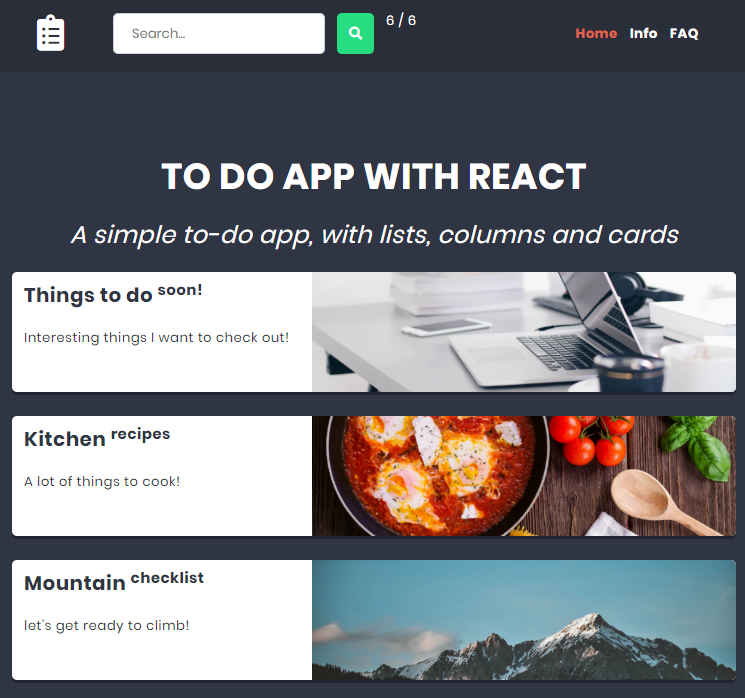

<p align="center">
<a href="https://to-do-list-with-react.herokuapp.com/"></a>
</p>


# <p align="center">✅ To do app with React</p>
<p align="center">Project for learning React, Redux and React Router</p>

</br>

## Table of Contents

- [What's this project about?](#about)
- [Technologies used](#technologies)
- [What I learned?](#what)
- [Interesting code snippet](#interesting)
- [Installation](#install)
- [NPM scripts](#npm)
- [GIT hooks](#git)
- [Website (on Heroku)](#site)

</br>

## <a name="about"></a>What's this project about?

This is a SPA to organize tasks and checklist, yes I know one panda has died... (another to-do-app 😋). It has several subpages realized by React Router. Search box allows to search to-do-cards and shows them on a separate page. After selecting the list, you can add further columns and cards to it.


</br>

## <a name="technologies"></a>Technologies used
- HTML
- CSS
- SCSS
- JavaScript
- React
- Redux
- Router
- webpack
- GIT

</br>

## <a name="what"></a>What I learned?
- use and configure a webpack (as a task runner and module bundler),
- use CSS and SCSS loaders to create for example random class names,
- difference between functional and class components, and why there will be more functional components in the future,
- principles of dependencies between components,
- debug React (using [React Developer Tools](https://chrome.google.com/webstore/detail/react-developer-tools/fmkadmapgofadopljbjfkapdkoienihi) for Chrome),
- check value types in props,
- work with state component,
- force code validation with ESLint only when committing (using the [husky](https://www.npmjs.com/package/husky) package),
- configure ESLint to check only modified files when committing (using the [lint-staged](https://www.npmjs.com/package/lint-staged) package),
- use Redux (create store, actions and reducers),
- debug Redux (using [Redux DevTools](https://chrome.google.com/webstore/detail/redux-devtools/lmhkpmbekcpmknklioeibfkpmmfibljd) for Chrome),
- use destructuring and other ES6 features,
- create regular expressions to filter strings,
- use React Router (Link, NavLink, Switch, AnimatedSwitch etc.),


</br>

## <a name="interesting"></a>Interesting code snippet (for me of course 😉)
- App component with React Router implementation:

```js
import MainLayout from '../MainLayout/MainLayout';
import { BrowserRouter, Route } from 'react-router-dom';
import { AnimatedSwitch } from 'react-router-transition';

const App = () => (
  <BrowserRouter>
    <MainLayout>
      <AnimatedSwitch
        atEnter={{ opacity: 0 }}
        atLeave={{ opacity: 0 }}
        atActive={{ opacity: 1 }}
        className={styles.switchWrapper}
      >
        <Route exact path='/' component={Home} />
        <Route exact path='/info' component={Info} />
        <Route exact path='/faq' component={FAQ} />
        <Route exact path='/list/:id' component={List} />
        <Route exact path='/search/:search' component={SearchResult} />
      </AnimatedSwitch>
    </MainLayout>
  </BrowserRouter>
);

export default App;
```
- MainLayout component syntax to display header on every subpage:

```js
import React from 'react';
import PropTypes from 'prop-types';
import Header from '../Header/Header';

const MainLayout = ({ children }) => (
  <div>
    <Header />
    {children}
  </div>
);

MainLayout.propTypes = {
  children: PropTypes.node,
};

export default MainLayout;
```

- Reducer code for adding columns:

```js
import shortid from 'shortid';

// selectors
export const getColumnsForList = ({ columns }, listId) => columns.filter(column => column.listId == listId);

// action name creator
const reducerName = 'columns';
const createActionName = name => `app/${reducerName}/${name}`;

// action types
export const ADD_COLUMN = createActionName('ADD_COLUMN');

// action creators
export const createActionAddColumn = payload => ({ payload: { ...payload, id: shortid.generate() }, type: ADD_COLUMN });

// reducer
export default function reducer(state = [], action = {}) {
  switch (action.type) {
    case ADD_COLUMN:
      return [...state, action.payload];
    default:
      return state;
  }
}
```

</br>

## <a name="install"></a>Installation

- use the package manager [npm](https://www.npmjs.com/get-npm) to install dependencies:

```bash
npm install

or

npm i
```
- run watch mode to start the server, constantly refreshing and more:

```bash
npm start
```

<br/>

## <a name="npm"></a>NPM scripts

There are 3 main scripts to speed up work:

- `start`: observes changes in the` src` folder and starts working preview,
- `build`: builds a project in the `dist` folder based on files from the `src` folder,
- `lint`: starting the lint code test,


<br/>


## <a name="git"></a>GIT hooks
The project uses Git Hooks - the ability to run scripts in response to selected Git events.

Each time you execute the `git commit` command, unit tests, formatting, and linting will be run
for files selected with `git add` and to be saved in commit.

<br/>


## <a name="site"></a>Website (on Heroku)
[React To do app](https://to-do-list-with-react.herokuapp.com/)
- if the page loads slowly, wait a moment, the server is waking up because it is hosted on a free platform Heroku.

</br>
</br>

  *project implemented as part of the 9-month [Web Developer Plus](https://kodilla.com/pl/bootcamp/webdeveloper/?type=wdp&editionId=309) course organized by [Kodilla](https://drive.google.com/file/d/1AZGDMtjhsHbrtXhRSIlRKKc3RCxQk6YY/view?usp=sharing)
